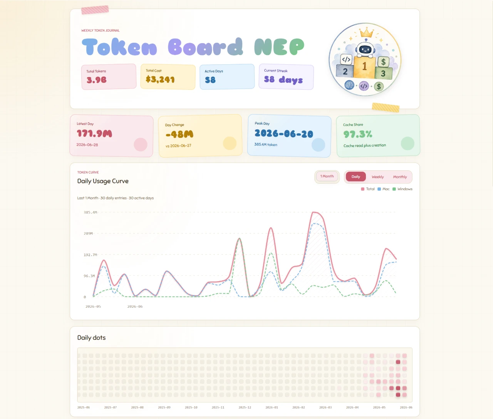

# Token Board

一个手账风（Scrapbook）的 LLM Token 使用量与成本看板主题，旨在直观展示多设备、多时间粒度（日、周、月）下的 Token 消耗、连续使用天数（Streaks）、Agent 使用统计及相关账单。



---

## 项目特性

- **温馨手账视觉设计**：纸质肌理底纹、精致的拟物胶带装饰、圆润饱满的字体设计（Sniglet）、带有自然投影效果的手绘贴纸卡片，以及带有随机微倾角和滚动渐显特效的动态面板。
- **金银铜牌排行榜**：消耗排名榜前三位分别突出显示为“金牌”、“银牌”与“铜牌”样式卡片，其余设备以雅致中性灰呈现。
- **动态热力图（Daily Dots）**：类 GitHub 提交记录的“日度圆点”日历网格，支持平滑的主题色渐变。默认横向滚动条自动锚定至最右侧（显示最新日期数据），且完美支持跨浏览器隐藏滚动条 UI。
- **多维度视图**：支持在 **日（Daily）**、**周（Weekly）**、**月（Monthly）** 多种时间间隔之间无缝切换折线图和统计数据。
- **多设备动态加载**：仅通过 `.env` 环境变量，即可实现任意多台设备名称和数据源的灵活载入与解析。
- **自定义 AI 与 CLI 品牌图标**：针对常用的 LLM 模型（Gemini、Claude、GPT）及命令行 Agent（OpenCode、Claude Code、Codex）内置了精美 SVG 品牌图标自动映射。

---

## 配置与使用

### 1. 采集 Token 数据
您可以使用以下命令行工具生成每日 Token 消耗 JSON 文件：
```bash
pnpx ccusage daily -j token-name.json
```
如果使用本地文件，请将生成的 JSON 文件放入项目的 `data/` 文件夹下，例如 `data/token-mac.json`。

也可以直接在 `.env` 中配置远程 JSON 地址，例如 `https://api.example.com/tboard/mac.json`。本项目会按字节读取 JSON，并兼容常见的 UTF-8 / UTF-16 BOM 编码；单个设备解析失败时会跳过该设备并输出警告，不会让整个看板构建失败。

### 2. 环境变量配置 (`.env`)
在 `themes/tboard` 项目根目录下创建 `.env` 文件，可动态声明要载入的设备及数据源地址：

```bash
# 要在看板展示的设备名称列表（英文逗号分隔）
TOKEN_DEVICES="Mac,Windows,iPad"

# 可选：为 TOKEN_DEVICES 中列出的设备指定 JSON 数据源
# 支持本地相对路径或远程 http(s) 链接
# 若某个已列出设备未填写 TOKEN_URL_[KEY]，系统会回退查找 "data/token-[设备名小写].json"
TOKEN_URL_MAC="data/token-mac.json"
TOKEN_URL_WINDOWS="data/token-windows.json"
TOKEN_URL_IPAD="data/token-ipad.json"

# 可选：自定义全站字体 CSS 样式表 CDN 加载链接（若留空则自动回退至默认的 Sniglet 字体）
# FONT_NAME 是可选的，若留空，系统会自动从 FONT_CDN_URL 的 query 中提取字体族名称（如从 family=Outfit 提取 Outfit）
# FONT_NAME="Sniglet"
FONT_CDN_URL="https://fonts.loli.net/css2?family=Sniglet:wght@400;800&display=swap"

# 可选：仅当自动提取失败时，才需要手动指定字体族名称
# FONT_NAME="Sniglet"

# 可选：自定义看板站点名称（显示在浏览器标题栏与网页主标题，默认为 "Token Board"）
SITE_NAME="Token Board"

# 可选：页面加载时的 "Thinking" 等待动画（默认开启，时长 2000 毫秒）
# - 不设置：默认开启，等待 2000ms
# - 设为 off / false / no / 0：关闭，直接显示看板
# - 设为正整数（毫秒）：自定义等待时长，例如 1500 表示 1.5 秒
THINKING_DELAY=2000
```

配置规则：

- `TOKEN_DEVICES` 是唯一的设备清单。只写 `TOKEN_URL_DEVICE_A` 但不把 `DeviceA` 写进 `TOKEN_DEVICES`，不会自动载入 DeviceA。
- 不设置 `TOKEN_DEVICES`，或设置为空值时，看板使用空设备数组，不会默认加载 Mac / Windows。
- 设备名称会自动转换为小写 key，如 `iPad` 转换为 `ipad`，并以此寻找 `TOKEN_URL_IPAD` 或本地 fallback 路径 `data/token-ipad.json`。
- 设备 key 不能重复，也不能使用保留名 `total` 或 `merged`。
- `THINKING_DELAY` 控制加载等待动画：缺省或正整数表示开启（单位毫秒，默认 2000），`off` / `false` / `no` / `0` 表示关闭。关闭后页面区块仍保留入场动画，只是不再有 "Thinking" 等待屏。
- 修改 `.env` 后需要重启 `pnpm dev`，环境变量通常不会热更新。

### 3. Favicon

默认 favicon 位于：

```text
public/images/favicon.webp
```

页面会通过 `/images/favicon.webp` 自动引用它。如需替换站点图标，直接替换该文件即可。

---

## 常用开发命令

本项目基于 Astro 静态网站框架构建。请确保您的系统已安装 Node.js 和 `pnpm`。

### 安装依赖
```bash
pnpm install
```

### 启动本地开发服务器
```bash
pnpm dev
```
启动后可在浏览器中打开 [http://127.0.0.1:4321](http://127.0.0.1:4321) 进行预览。

### 编译静态资源（生产环境打包）
```bash
pnpm build
```
执行后会在 `dist/` 目录下生成打包压缩好的、可直接部署的静态 HTML 资源。

---

## 关键代码结构

- [index.astro](src/pages/index.astro)：前端 UI 页面模板、交互开关、favicon 引用和折线图图例控制逻辑。
- [global.css](src/styles/global.css)：全站手账设计系统样式文件，包含卡片投影、微倾斜排版和移动端适配。
- [tokenData.ts](src/lib/tokenData.ts)：核心数据归档层，负责环境变量解析、JSON 编码兜底、日历圆点渐变、SVG 贝塞尔平滑曲线及设备对齐。
- **`data/`**：可选的本地 Token 历史明细 JSON 目录；不会在未配置 `TOKEN_DEVICES` 时自动加载。
- **`public/images/favicon.webp`**：站点 favicon。
- **`public/model/`**：存放各模型与 Agent 品牌定制 SVG 图标文件的目录。
